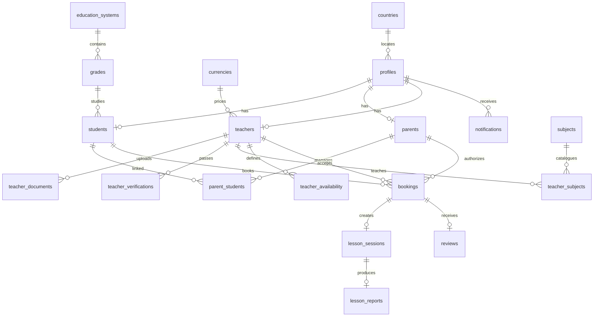

# نُخبة — Phase 0 Product Architecture

## 1. Product Architecture

نُخبة منصة تعليمية ثنائية الجانب تبدأ من السوق السعودي، وتربط الطالب أو ولي الأمر بمعلمين موثقين عبر ثلاث حلقات: **الاكتشاف الذكي، الحجز المنظم، والمتابعة القابلة للقياس**. جوهر المنتج ليس دليل معلمين، بل طبقة ثقة وقرار تساعد الأسرة على اختيار المعلم المناسب ثم تحويل كل حصة إلى تقدم واضح.

المجالات الأساسية في الـMVP هي: الهوية والملفات الشخصية، سوق المعلمين، التحقق، التوفر والحجز، لوحات المتابعة، تقارير الحصص، التقييمات، والإشعارات. الذكاء الاصطناعي في المرحلة الأولى يظهر كـSmart Match قابل للتفسير؛ أما المدرس الذكي، الاختبارات التوليدية، وخطة المذاكرة فموضوعة خلف حدود خدمة مستقلة للتوسع لاحقًا.

**حدود MVP:** لا توجد بوابة دفع حقيقية ولا نظام فيديو مملوك للمنصة. توجد عقود بيانات وواجهات Provider Adapters تسمح بربط مزود دفع وفيديو لاحقًا دون تغيير تجربة المستخدم أو نموذج الحجز.

## 2. Sitemap

| المسار | الجمهور | الهدف |
|---|---|---|
| `/` | عام | التعريف بالمنتج والتحويل إلى الاكتشاف أو التسجيل |
| `/teachers` | طالب/ولي أمر | البحث والتصفية ومقارنة المعلمين |
| `/teachers/:id` | طالب/ولي أمر | قراءة الملف، التوفر، والتوجه للحجز |
| `/dashboard/student` | طالب | الحصص، المعلمون، التقدم، والخطة |
| `/dashboard/parent` | ولي أمر | الأبناء، الحضور، التقارير، والنتائج |
| `/dashboard/teacher` | معلم | الجدول، الطلبات، والتقارير |
| `/dashboard/admin` | إدارة | مؤشرات المنصة ومراجعة المعلمين |
| `/auth` | كل الأدوار | تسجيل الدخول أو إنشاء الحساب |

## 3. User Journeys

**الأسرة:** يزور المستخدم الصفحة الرئيسية → يحدد المرحلة والمادة → يرى نتائج موصى بها مع سبب توافق واضح → يفتح ملف المعلم → يختار فترة متاحة → ينشئ حسابًا أو يسجل الدخول → يرسل طلب حجز → يتابع التقرير بعد الحصة.

**المعلم:** يختار «انضم كمعلم» → ينشئ ملفًا مهنيًا → يرفع وثائق التحقق → ينتقل إلى Pending/Under Review → يراجع Admin الملف → Approved يجعل الملف ظاهرًا في السوق → يحدد الساعات والحجوزات → يكتب تقرير الحصة.

**ولي الأمر:** يسجل كولي أمر → يضيف أبناءه ويحدد العلاقة → يربط كل طالب بخطة تعلم → يرى لوحة موحدة لكل ابن → يتلقى تقارير الحصص والإشعارات والتوصيات.

**الإدارة:** يراجع مؤشرات الطلاب والمعلمين والحجوزات → يفتح قائمة Pending → يتحقق من المستندات → يعتمد أو يرفض مع سبب → يتابع الجودة والتقييمات والعمولة.

## 4. Database ERD

الجداول الأساسية: `profiles`, `students`, `parents`, `parent_students`, `teachers`, `teacher_documents`, `teacher_verifications`, `countries`, `currencies`, `education_systems`, `grades`, `subjects`, `curriculum`, `teacher_subjects`, `teacher_availability`, `bookings`, `lesson_sessions`, `lesson_reports`, `reviews`, `notifications`. جميع الجداول تحتوي `id`, `created_at`, `updated_at`, و`deleted_at` عند الحاجة، مع فهارس مركبة على البحث والحجز. منع الحجز المزدوج يعتمد على فحص زمني داخل Transaction وقيد تداخل في طبقة قاعدة البيانات.

## 5. Roles & Permissions

| الدور | نطاق الوصول | صلاحيات رئيسية |
|---|---|---|
| Student | بياناته ومعلموه وحجوزاته | البحث، الحجز، حضور الحصة، رؤية تقاريره |
| Parent | نفسه وأبناؤه فقط | إدارة الأبناء، الحجز نيابة عنهم، التقارير |
| Teacher | ملفه وطلابه المرتبطون | التوفر، قبول الحجز، تقارير الحصص |
| Admin | نطاق المنصة | مراجعة المعلمين، إدارة المحتوى، مؤشرات التشغيل |
| Super Admin | كامل النظام | RBAC، الدول والعملات، إعدادات المنصة |
| Support | تشغيل محدود | دعم الحجوزات دون بيانات مالية أو وثائق حساسة |

التطبيق النهائي يستخدم Supabase Auth وRLS بسياسات مرتبطة بـ`auth.uid()` وrole claims. الواجهة لا تُعد بديلًا عن سياسات الخادم.

## 6. Technical Architecture

واجهة React/TypeScript عربية RTL مع Design Tokens قابلة للتبديل، وطبقة API typed. في بيئة WebDev الحالية يبدأ الـMVP على scaffold full-stack مزود بـDrizzle وManus OAuth؛ صُمم domain layer بعقود محايدة تسمح بترحيل persistence إلى Supabase/PostgreSQL عند ربط المشروع ببيئة الإنتاج المطلوبة. خدمات مستقلة مستقبلية: `matching-service`, `payment-provider-adapter`, `video-provider-adapter`, `notification-service`, و`analytics-events`.

كل الوقت المخزن UTC مع عرض محلي بحسب الدولة. البحث يستخدم فهارس على المادة والمرحلة والتقييم والسعر. المستندات في Object Storage مع signed URLs، ولا تُحفظ bytes داخل قاعدة البيانات. الأسرار server-side فقط، والتحقق من المدخلات عبر schemas، والـadmin routes محمية على الخادم.

## 7. Design System

**الهوية:** نُخبة هادئة وموثوقة؛ لا تشبه منصة مدرسية تقليدية. اللون الأساسي Ink Navy `#13233A`، لون الثقة Teal `#0E7C78`، لون الإبراز Saffron `#E8A64A`، وخلفية Parchment `#F7F6F2`. الاستخدام محدود إلى لون أساسي، لون حالة، ولمسات إبراز.

**الخط:** IBM Plex Sans Arabic أو Noto Sans Arabic؛ عناوين ذات وزن 600، نصوص 400/500، أرقام KPI بوزن 700. نصف قطر 16px للمساحات الأساسية و10px للعناصر الصغيرة. الظلال خفيفة وناعمة بدل الحدود الثقيلة.

**المكونات:** Button واضح الحالة، Badge للتحقق، SearchField، FilterRail، TeacherCard، AvailabilityRow، KPI, ProgressBar, Timeline, EmptyState, Toast. الحركة 160–240ms مع احترام `prefers-reduced-motion`.

## 8. MVP Roadmap

| الإصدار | النطاق | معيار الخروج |
|---|---|---|
| M0 | الهوية، Landing، سوق المعلمين، ملف المعلم، لوحات Demo | تجربة RTL متماسكة ومسارات قابلة للنقر |
| M1 | Auth حقيقي، ملفات الأدوار، RBAC، Supabase schema/RLS | لا يمكن عزل بيانات مستخدم عن آخر |
| M2 | Availability + Booking + Calendar + notifications | منع double booking واختبارات حجز |
| M3 | Lesson reports + reviews + parent progress | تقرير حصة ظاهر للجهة الصحيحة |
| M4 | Matching v1، payment adapter، video adapter | توصية مفسّرة وسجلات أحداث |
| M5 | تشغيل السعودية ثم إعداد مصر | الدولة والعملة والمنهج إعدادات لا hard-code |

**وضع البيانات في الـMVP الحالي:** كل الأرقام والمعلمين الظاهرين في الواجهة موسومة Demo، ولا تمثل مستخدمين أو معاملات حقيقية.
